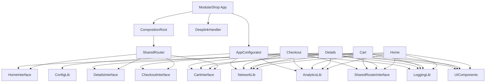

# ModularShop

Yet another iOS modular architecture sample — but this one's worth stealing from.

## Why This Exists

Most modular architecture samples stop at "here's how to split code into modules." This project goes further. The goal is to incrementally build out a real-world iOS app that tackles the problems you actually hit at scale — not just the clean diagrams.

We're working through topics like:
- Clean module boundaries with protocol-based interfaces
- Basic dependency injection without third-party frameworks
- Smarter app launch orchestration
- Benchmarking module builds at scale
- Better localisation patterns
- Type-safe analytics
- ...and more as we go

Each topic gets refined iteratively, so the codebase evolves the way a real project would.

## Blogs

WIP — each major topic will have an accompanying blog post. Stay tuned.

## App Overview

ModularShop is a lightweight e-commerce app built with **UIKit**, **Combine**, and **Swift Package Manager**. Every feature lives in its own SPM module with a clear interface-implementation split, making it easy to build, test, and reason about in isolation.

### Modules

The project splits into **Feature Modules** (screens and business logic) and **Library Modules** (shared infrastructure).

**Feature Modules** — each has an `Interface` (public protocols/models) and an `Implementation` (coordinator, view model, view controller, repository):

| Module | What it does |
|--------|-------------|
| **Home** | Product listing screen — the app's entry point |
| **Details** | Product detail screen with add-to-cart |
| **Cart** | View, update, and remove cart items |
| **Checkout** | Order summary and placement |
| **SharedRouter** | Centralised navigation via a `Route` enum |

**Library Modules** — shared utilities with no business logic:

| Module | What it does |
|--------|-------------|
| **ConfigLib** | Reads runtime config from `AppConfig.plist` |
| **LoggingLib** | Simple levelled logger (`debug`, `info`, `warning`, `error`) |
| **NetworkLib** | Protocol-based networking with mock support |
| **AnalyticsLib** | Event tracking with batching and in-memory cache |
| **UIComponents** | Base view controller, theme colours, layout helpers |

### Dependency Graph



### Root Components

- **`AppConfigurator`** — Runs the app's sequential launch setup: config, logging, network, analytics, and appearance.
- **`CompositionRoot`** — The DI container. Creates all dependencies, assembles coordinators, and returns the initial screen.
- **`DeeplinkHandler`** — Parses `modularshop://` URLs and routes them to the right screen via SharedRouter.

### App Flow

The app has four screens: **Home → Details → Cart → Checkout**.

- **Home** shows a product list. Tap a product to go to **Details**, or tap the cart icon to go to **Cart**.
- **Details** shows product info. You can add to cart, jump to **Cart**, or buy now to go straight to **Checkout**.
- **Cart** lists your items. You can update quantities, remove items, tap a product to revisit **Details**, or proceed to **Checkout**.
- **Checkout** shows the order summary. Placing an order brings you back to **Home**.

Deeplinks are supported via the `modularshop://` scheme (e.g. `modularshop://product/42`, `modularshop://cart`).

## Getting Started

```bash
git clone https://github.com/nicklama/ios-modular-arch.git
cd ios-modular-arch
open ModularShop.xcodeproj
```

Select the **ModularShop** scheme, pick a simulator (iOS 17+), and hit **Run**.

> Requires **Xcode 15+** and **Swift 5.9**.

Modules are defined in `Package.swift` at the repo root — Xcode resolves them automatically. No `pod install` or manual setup needed.
