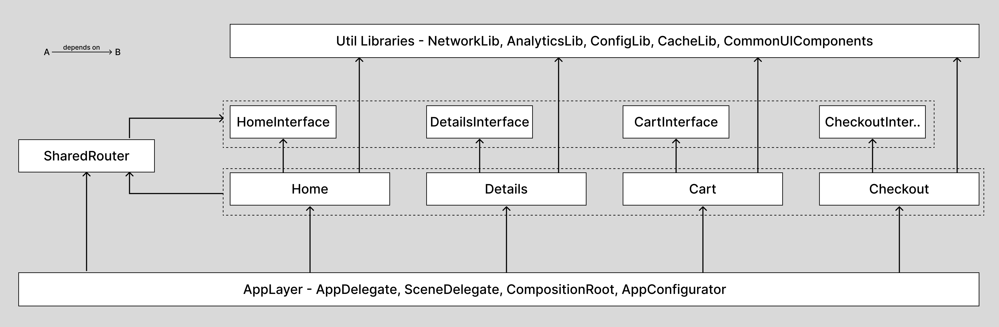

# ModularShop

Yet another iOS modular architecture sample — but this one's worth stealing from.

## Why This Exists

The way we build apps has changed. AI can write your networking layer, generate view controllers, and scaffold features in minutes. But the bottleneck has shifted. Writing code is no longer the hard part. Structuring it is. In a world where AI makes everyone a fast coder, the ones who understand structure become the architects that teams actually need.

We are working through topics like:
- Clean module boundaries with protocol-based interfaces
- Dependency injection without third-party frameworks
- App launch orchestration and optimization
- Type-safe analytics with batching
- Configuration management with remote config
- Benchmarking and performance
- ...and more as we go

Each topic gets refined iteratively, so the codebase evolves the way a real project would.

## Blog Series: Building Modular iOS Apps That Scale

Each major topic has an accompanying blog post. Read them in the [docs folder](docs/README.md) or on Medium/Hashnode.

Use the [Releases](https://github.com/NitishGadangi/ios-modular-arch/releases) tab to browse the codebase at the exact state of each article.

1. **[Part 1: The Foundation](docs/01-the-foundation.md)** — Feature modules, dependency inversion, and the wiring that holds it all together.

*More articles coming soon.*

## App Overview

ModularShop is a lightweight e-commerce app built with **UIKit**, **Combine**, and **Swift Package Manager**. Every feature lives in its own SPM module with a clear interface-implementation split, making it easy to build, test, and reason about in isolation.

### Modules

**Feature Modules** — each has an `Interface` (public protocols/models) and an `Implementation` (coordinator, view model, view controller, repository):

| Module | What it does |
|--------|-------------|
| **Home** | Product listing screen — the app's entry point |
| **Details** | Product detail screen with add-to-cart |
| **Cart** | View, update, and remove cart items |
| **Checkout** | Order summary and placement |
| **SharedRouter** | Centralised navigation via a `Route` enum |

**Library Modules** — shared utilities with no business logic:

| Module | What it does |
|--------|-------------|
| **NetworkLib** | Protocol-based HTTP client with request/response logging |
| **CacheLib** | Two-tier image cache (memory + disk) |
| **LoggingLib** | Console logger with configurable log levels |
| **AnalyticsLib** | Event tracking with batching and flushing |
| **ConfigLib** | App configuration with remote config support |
| **UIComponents** | Reusable UI elements and extensions |

### Dependency Graph


*Full dependency graph across all modules. Arrows point from dependent to dependency.*

### Root Components

- **`AppConfigurator`** — Runs the app's sequential launch setup: config, logging, network, analytics, and appearance.
- **`CompositionRoot`** — The DI container. Creates all dependencies, assembles coordinators, and returns the initial screen.
- **`DeeplinkHandler`** — Parses `modularshop://` URLs and routes them to the right screen via SharedRouter.

### App Flow

The app has four screens: **Home → Details → Cart → Checkout**.

- **Home** shows a product list. Tap a product to go to **Details**, or tap the cart icon to go to **Cart**.
- **Details** shows product info. You can add to cart, jump to **Cart**, or buy now to go straight to **Checkout**.
- **Cart** lists your items. You can update quantities, remove items, tap a product to revisit **Details**, or proceed to **Checkout**.
- **Checkout** shows the order summary. Placing an order brings you back to **Home**.

Deeplinks are supported via the `modularshop://` scheme (e.g. `modularshop://product/42`, `modularshop://cart`).

## Getting Started

```bash
git clone https://github.com/NitishGadangi/ios-modular-arch.git
cd ios-modular-arch
open ModularShop.xcodeproj
```

Select the **ModularShop** scheme, pick a simulator (iOS 17+), and hit **Run**.

> Requires **Xcode 15+** and **Swift 5.9**.

Modules are defined in `Package.swift` at the repo root — Xcode resolves them automatically. No `pod install` or manual setup needed.
