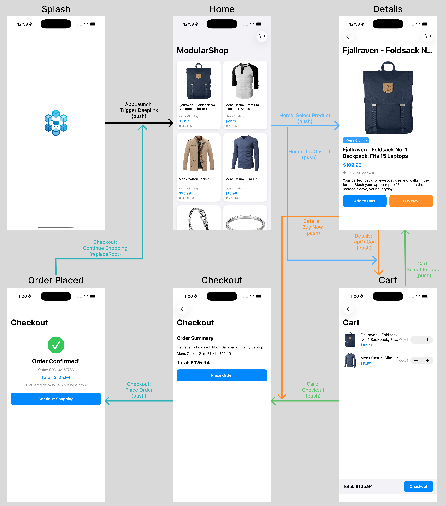
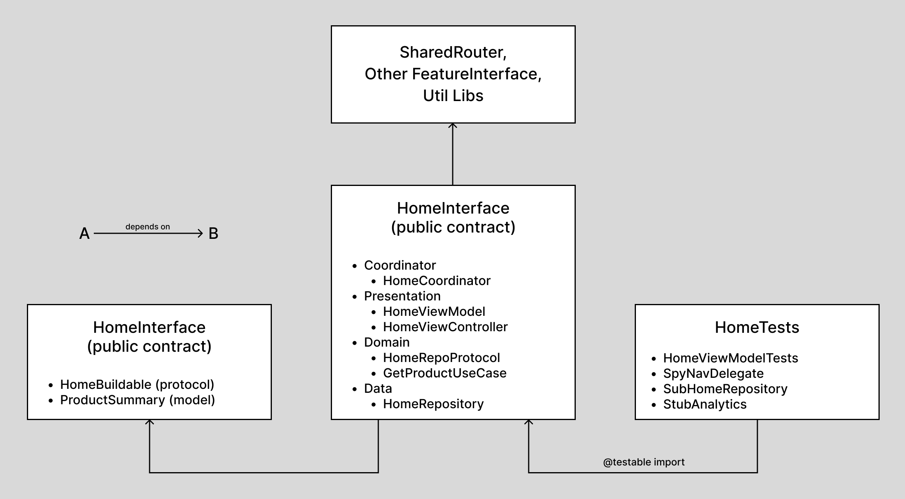
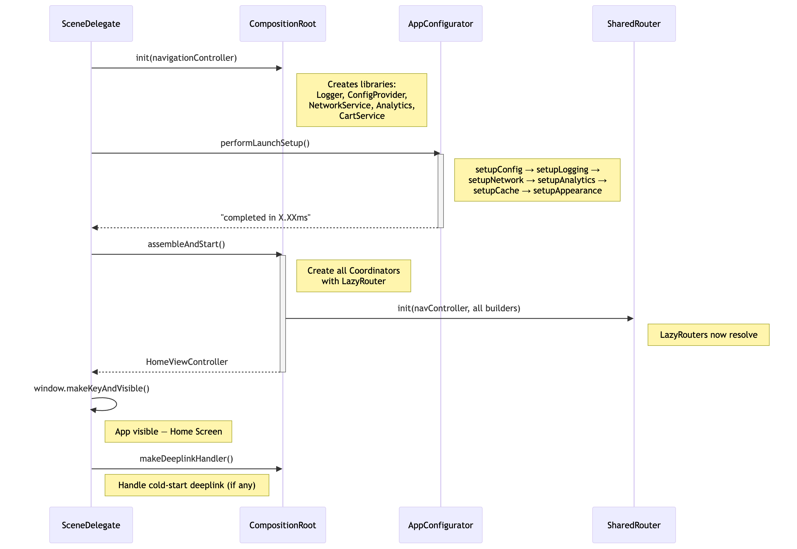

# Building Modular iOS Apps That Scale | Part 1: The Foundation

**Feature modules, dependency inversion, and the wiring that holds it all together.**

The way we build apps has changed. AI can write your networking layer, generate view controllers, and scaffold features in minutes. But the bottleneck has shifted. Writing code is no longer the hard part. Structuring it is. In a world where AI makes everyone a fast coder, the ones who understand structure become the architects that teams actually need.

This series covers modular architecture, app launch optimization, dependency injection, analytics, configuration, and benchmarking. We start with a solid foundation and improve one piece at a time, tackling real problems as they come up.

In this first article, we set up the basement. How should an app be structured so that we can plug in new features, swap out libraries, and still have a developer-friendly codebase?

**TLDR;** If you are not patient enough to read through the whole article and want to jump straight to code, here is the [GitHub repo](https://github.com/NitishGadangi/ios-modular-arch). Clone it, open in Xcode, and explore. Totally fine in this short attention span era.

## What we are building

ModularShop is a small, dummy e-commerce app. Four screens, six utility libraries, nothing fancy on the UI side. The idea is to have just enough features to mirror the problems you run into in large-scale, real-world apps. Simple UI, less overwhelming code, but all the structural components intact.

The entire thing is built with UIKit, Combine, and Swift Package Manager. Zero third-party dependencies. You can clone the repo, open it in Xcode, and everything just resolves.

## The app at a glance

The app has four screens:

- **Home**: Fetches and lists products from a remote API.
- **Details**: Shows a single product with an "Add to Cart" button.
- **Cart**: Lists items the user has added, with a running total.
- **Checkout**: A confirmation screen that clears the cart on completion.

Navigation between these screens supports push, present, and root replacement. The app also handles deeplinks, so you can jump directly to any screen on launch or while the app is running.

On the library side, we have six shared modules that any feature can use:

- **NetworkLib**: HTTP client with request/response logging.
- **CacheLib**: Two-tier cache (memory + disk).
- **LoggingLib**: Console logger with configurable log levels.
- **AnalyticsLib**: Event tracking with batching and flushing.
- **ConfigLib**: App configuration with remote config support.
- **UIComponents**: Reusable UI elements and extensions.


*All navigation paths between the four screens, including deeplink entry points.*

## The real deal: Split features into Interface, Implementation and Test modules

Here is where the real decisions start. Every feature in ModularShop is split into three distinct parts, and the reason for this split is fundamental to how the entire architecture works.

**Interface module** (`HomeInterface`): This is the public contract. It contains protocols and shared models only. Nothing concrete. Other modules that need to talk to Home depend on this, not on Home's actual code. The interface is intentionally thin. Here is the entire `HomeBuildable` protocol:

```swift
public protocol HomeBuildable {
    func buildHomeScreen() -> UIViewController
}
```

*[View on GitHub](https://github.com/NitishGadangi/ios-modular-arch/blob/3b24d4a/Modules/Home/HomeInterface/Sources/HomeBuildable.swift)*

That is the whole file. One protocol, one method. Any module that needs to create a Home screen depends on this protocol, not on the coordinator, not on the view model, not on any of the internal wiring. This is dependency inversion at the module level.

**Implementation module** (`Home`): This is where the actual code lives. Coordinator, ViewModel, ViewController, Repository, UseCase. All internal. No other feature module ever imports this. The `HomeCoordinator` conforms to `HomeBuildable` and handles the construction chain:

```swift
public final class HomeCoordinator: HomeBuildable {
    private let router: SharedRouterProtocol
    private let networkService: NetworkServiceProtocol
    // ... other dependencies

    public func buildHomeScreen() -> UIViewController {
        let repository = HomeRepository(networkService: networkService)
        let useCase = GetProductsUseCase(repository: repository)
        let viewModel = HomeViewModel(getProductsUseCase: useCase, analytics: analytics)
        viewModel.navigationDelegate = self
        return HomeViewController(viewModel: viewModel)
    }
}
```

*[View on GitHub](https://github.com/NitishGadangi/ios-modular-arch/blob/3b24d4a/Modules/Home/Home/Sources/Coordinator/HomeCoordinator.swift#L1-L25)*

Notice the imports at the top of the actual file: `HomeInterface`, `SharedRouterInterface`, `NetworkLib`, `AnalyticsLib`. Only interfaces and libraries. There is no `import Details` or `import Cart` anywhere. This is the key rule: **no feature depends on another feature's implementation.** Home does not know Details exists. Details does not know Cart exists. They communicate through interface protocols, and a shared router handles the actual screen transitions. We will get to that shortly.

**Test target** (`HomeTests`): Uses `@testable import Home` to access internals. Stubs and spies are local to the test target. Here is how a typical test looks:

```swift
private func makeSUT(products: [ProductSummary] = []) -> HomeViewModel {
    let repo = StubHomeRepository(products: products)
    let useCase = GetProductsUseCase(repository: repo)
    return HomeViewModel(getProductsUseCase: useCase, analytics: StubAnalytics())
}

func testNavigationOnProductSelected() {
    let sut = makeSUT()
    let spy = SpyNavDelegate()
    sut.navigationDelegate = spy

    sut.actionHandler.send(.selectProduct(id: "42"))

    XCTAssertEqual(spy.receivedEvents.count, 1)
    // assert the event is .productSelected with id "42"
}
```

*[View on GitHub](https://github.com/NitishGadangi/ios-modular-arch/blob/3b24d4a/Modules/Home/HomeTests/HomeViewModelTests.swift)*

The `makeSUT()` pattern (make System Under Test) wires up just enough to test the ViewModel in isolation. `StubHomeRepository` returns canned data, `StubAnalytics` is a no-op, and `SpyNavDelegate` captures navigation events so we can assert on them. Because every dependency is injected through a protocol, we can stub any of them. This is the testability payoff of the entire module structure.

**Why this three-way split?** Because it gives you real isolation. When a developer changes something inside the Home implementation, the Details module does not recompile. The test target does not accidentally leak internal types into other modules. And if you ever want to run a feature in isolation (say, with its own Xcode scheme for faster iteration), the interface boundary is already clean enough to support that.

While each feature module can have its own internal architecture, we went with MVVM + Coordinator across the board. ViewModels expose state via `CurrentValueSubject` and accept actions via `PassthroughSubject`. Coordinators build screens and handle navigation. Consistent, but not enforced. A new feature could use a different pattern without affecting anything else.


*Three-part split for the Home feature: Interface, Implementation, and Test modules.*

## The dependency graph

The module split above gives us a clean dependency graph with a simple rule: features point down to abstractions and libraries, never sideways to other features' implementations.

Here is what the Home target's dependencies look like in `Package.swift`:

```swift
.target(
    name: "Home",
    dependencies: [
        "HomeInterface",
        "SharedRouterInterface",
        "NetworkLib",
        "AnalyticsLib",
        "LoggingLib",
        "UIComponents",
    ],
    path: "Modules/Home/Home/Sources"
),
```

*[View on GitHub](https://github.com/NitishGadangi/ios-modular-arch/blob/3b24d4a/Package.swift#L86-L97)*

`HomeInterface` and `SharedRouterInterface` are abstractions. `NetworkLib`, `AnalyticsLib`, `LoggingLib`, and `UIComponents` are self-contained utility libraries. There is no `Details`, `Cart`, or `Checkout` anywhere in that list.

This matters for a few concrete reasons:

**Build times.** When someone changes a file inside the Details module, Xcode does not recompile Home. In a monolithic target, any change recompiles everything. With four features this barely matters. With forty, it is the difference between a 10-second incremental build and a 2-minute one.

**Parallel development.** Two developers working on Home and Details at the same time will not step on each other's code. Their modules do not share implementation files. Merge conflicts drop dramatically.

**Separation of concerns.** Each feature owns its own domain logic, its own data layer, its own view layer. There is no shared "Models" folder where every feature dumps its types. If Home needs a `ProductSummary` model, it lives in `HomeInterface`. If Details needs a `ProductDetail` model, it lives in `DetailsInterface`.

The same pattern applies across the board. Details depends on `DetailsInterface`, `SharedRouterInterface`, and `CartInterface` (because it needs to add items to cart). But it imports `CartInterface`, not `Cart`. It knows the protocol for adding to cart. It does not know or care how cart storage is implemented.


*Full dependency graph across all modules.*

## SPM: One Package.swift for everything

All of these modules, every library, interface, feature, and test target, are defined in a single `Package.swift` file. No CocoaPods, no Carthage, no scattered xcframework references. One file describes the entire module graph.

```swift
let package = Package(
    name: "ModularShop",
    platforms: [.iOS(.v17)],
    products: [
        // Libraries
        .library(name: "LoggingLib", targets: ["LoggingLib"]),
        .library(name: "NetworkLib", targets: ["NetworkLib"]),
        // ... other libraries

        // Interface modules
        .library(name: "SharedRouterInterface", targets: ["SharedRouterInterface"]),
        .library(name: "HomeInterface", targets: ["HomeInterface"]),
        // ... other interfaces

        // Concrete modules
        .library(name: "SharedRouter", targets: ["SharedRouter"]),
        .library(name: "Home", targets: ["Home"]),
        // ... other features
    ],
    dependencies: [],
    // targets: [ ... ]
)
```

*[View on GitHub](https://github.com/NitishGadangi/ios-modular-arch/blob/3b24d4a/Package.swift#L1-L30)*

The advantage of this approach is simplicity. You clone the repo, open in Xcode, and SPM resolves everything. No setup scripts, no dependency managers to install, no pod install that takes 3 minutes. Adding a new module means adding a few lines to this file. The full Package.swift has all 17 library products and their corresponding targets, including test targets with their dependencies. Check the repo for the complete file.

## SharedRouter: Cross-module navigation

This is where the "features do not know about each other" promise gets tested. When the user taps a product on the Home screen, Home needs to show the Details screen. But Home does not import Details. It does not even know Details exists. So how does navigation work?

The answer is a shared router that sits between all features. Features tell the router *what* they want to navigate to (a route), and the router figures out *how* to build that screen and present it.

The routing contract lives in `SharedRouterInterface` as three small types:

```swift
public enum Route: Equatable {
    case home
    case productDetail(productId: String)
    case cart
    case checkout
}

public enum NavigationStyle {
    case push
    case present(fullScreen: Bool = false)
    case replaceRoot
}

public protocol SharedRouterProtocol: AnyObject {
    func navigate(to route: Route, style: NavigationStyle)
}
```

*[View on GitHub](https://github.com/NitishGadangi/ios-modular-arch/blob/3b24d4a/Modules/SharedRouter/SharedRouterInterface/Sources/)*

`Route` defines every possible destination. `NavigationStyle` controls how we get there. And `SharedRouterProtocol` is what features actually depend on. This is all in the Interface module, so every feature can use it without depending on the concrete router.

The concrete `SharedRouter` is the only module that knows about all the feature builders. It receives them through init, maps routes to screens, and performs the navigation:

```swift
public func navigate(to route: Route, style: NavigationStyle) {
    let viewController = buildScreen(for: route)
    switch style {
    case .push:
        navigationController?.pushViewController(viewController, animated: true)
    case .present(let fullScreen):
        // handle modal presentation
    case .replaceRoot:
        navigationController?.setViewControllers([viewController], animated: true)
    }
}

private func buildScreen(for route: Route) -> UIViewController {
    switch route {
    case .home: return homeBuilder.buildHomeScreen()
    case .productDetail(let id): return detailsBuilder.buildDetailsScreen(productId: id)
    case .cart: return cartBuilder.buildCartScreen()
    case .checkout: return checkoutBuilder.buildCheckoutScreen()
    }
}
```

*[View on GitHub](https://github.com/NitishGadangi/ios-modular-arch/blob/3b24d4a/Modules/SharedRouter/SharedRouter/Sources/SharedRouter.swift#L29-L56)*

Notice that `SharedRouter` depends on `HomeBuildable`, `DetailsBuildable`, `CartBuildable`, `CheckoutBuildable`. Those are all interface protocols. It does not import any feature's implementation module. The concrete coordinators get injected from the outside (by CompositionRoot, which we will get to).

Back in the Home module, the coordinator uses the router through its delegate. When the ViewModel fires a navigation event, the coordinator translates it into a route:

```swift
extension HomeCoordinator: HomeViewModelNavigationDelegate {
    func homeViewModel(_ viewModel: HomeViewModel, didRequest event: HomeViewModel.NavigationEvent) {
        switch event {
        case .productSelected(let id):
            router.navigate(to: .productDetail(productId: id), style: .push)
        case .cartTapped:
            router.navigate(to: .cart, style: .push)
        }
    }
}
```

*[View on GitHub](https://github.com/NitishGadangi/ios-modular-arch/blob/3b24d4a/Modules/Home/Home/Sources/Coordinator/HomeCoordinator.swift#L27-L36)*

The flow is: user taps a product -> ViewModel sends a `.selectProduct` action -> Coordinator catches it via delegate -> Coordinator tells the router "navigate to `.productDetail`" -> Router builds the Details screen and pushes it. Home never touches Details directly. The router is the single orchestrator for all cross-module navigation.

## AppConfigurator: Managing app launch

Before any screen appears, there is work to do. Config needs to load. Logging needs to initialize. The network layer needs a base URL. Analytics needs to know if it is enabled. All of this has to happen before the first ViewController is presented.

`AppConfigurator` puts all of that under one roof. A single `performLaunchSetup()` call that runs each step and measures the total time:

```swift
func performLaunchSetup() {
    let startTime = CFAbsoluteTimeGetCurrent()

    setupConfig()
    setupLogging()
    setupNetwork()
    setupAnalytics()
    setupCache()
    setupAppearance()

    let durationMs = (CFAbsoluteTimeGetCurrent() - startTime) * 1000
    logger.info("App launch setup completed in \(String(format: "%.2f", durationMs))ms")
}
```

*[View on GitHub](https://github.com/NitishGadangi/ios-modular-arch/blob/3b24d4a/ModularShop/Core/AppConfigurator.swift#L26-L38)*

Each setup method receives its dependencies through the initializer (logger, config provider, analytics service, network service), does its configuration, and logs what it did. The timing measurement at the end gives us a baseline number for launch performance.

This is straightforward and it works. But it is also the simplest possible approach, and it will not scale. Right now we have six steps that run in under a millisecond. In a real production app, you might have twenty steps: remote config fetches, database migrations, feature flag evaluation, A/B test assignment, push notification registration. Some of these are slow. Some depend on each other. Some could run in parallel but do not because everything is sequential.

We will tackle this properly in the next article using `NSOperation` and `OperationQueue`, where each step becomes an operation with explicit dependencies and the queue handles parallelism for us.

## CompositionRoot: Wiring it all together

We have features behind protocols, libraries behind protocols, a router behind a protocol. Now someone has to actually create the concrete instances and connect them. That is what `CompositionRoot` does.

This is the single place in the entire app that imports both interface and implementation modules. It creates the libraries, creates the coordinators, creates the router, and returns the first screen. Every protocol meets its concrete type here and nowhere else.

But there is an interesting problem. Coordinators need a router to navigate. The router needs coordinators (as builders) to construct screens. Neither can be created first. Classic chicken-and-egg.

The workaround is `LazyRouter`: a lightweight proxy that conforms to `SharedRouterProtocol` but defers the actual routing to a closure that resolves later:

```swift
private final class LazyRouter: SharedRouterProtocol {
    private let resolver: () -> SharedRouterProtocol?

    init(_ resolver: @escaping () -> SharedRouterProtocol?) {
        self.resolver = resolver
    }

    func navigate(to route: Route, style: NavigationStyle) {
        resolver()?.navigate(to: route, style: style)
    }
}
```

*[View on GitHub](https://github.com/NitishGadangi/ios-modular-arch/blob/3b24d4a/ModularShop/Core/CompositionRoot.swift#L98-L112)*

With this in place, `assembleAndStart()` can create coordinators first (with a `LazyRouter` that will resolve to the real router), then create the real router with those coordinators, and everything connects:

```swift
func assembleAndStart() -> UIViewController {
    homeCoordinator = HomeCoordinator(
        router: LazyRouter { [weak self] in self?.router },
        networkService: networkService,
        analytics: analyticsService
    )
    // ... same pattern for Details, Cart, Checkout coordinators

    router = SharedRouter(
        navigationController: navigationController,
        homeBuilder: homeCoordinator,
        detailsBuilder: detailsCoordinator,
        cartBuilder: cartCoordinator,
        checkoutBuilder: checkoutCoordinator
    )

    return homeCoordinator.buildHomeScreen()
}
```

*[View on GitHub](https://github.com/NitishGadangi/ios-modular-arch/blob/3b24d4a/ModularShop/Core/CompositionRoot.swift#L56-L91)*

By the time the user actually taps something and triggers navigation, the real router is already set. The `LazyRouter` resolves to it, and everything works.

The boot sequence in `SceneDelegate` ties it all together. This is the entry point of the app:

```swift
let navigationController = UINavigationController()
compositionRoot = CompositionRoot(navigationController: navigationController)

// Configure all services before anything else
compositionRoot.appConfigurator.performLaunchSetup()

// Wire up all modules and get the first screen
let rootVC = compositionRoot.assembleAndStart()
navigationController.viewControllers = [rootVC]

window = UIWindow(windowScene: windowScene)
window?.rootViewController = navigationController
window?.makeKeyAndVisible()

// Deeplink handling
deeplinkHandler = compositionRoot.makeDeeplinkHandler()
```

*[View on GitHub](https://github.com/NitishGadangi/ios-modular-arch/blob/3b24d4a/ModularShop/SceneDelegate.swift#L9-L34)*

The order matters: create the navigation controller, create the CompositionRoot, run launch setup (config, logging, network, analytics, etc.), assemble all the modules, set the root screen, then make the window visible. Deeplink handling is set up last so it has access to the fully wired router.


*Boot sequence from SceneDelegate to the first visible screen.*

## Why does any of this matter?

You could build a four-screen app in a single Xcode target and ship it in a day. So why go through all this structure?

Because apps do not stay four screens forever. Features get added. Teams grow. And the decisions you make early shape whether adding the tenth feature feels the same as adding the second, or whether it requires untangling months of accumulated coupling.

With this setup, adding a new feature is mechanical: create its Interface and Implementation modules, add the target to Package.swift, wire it up in CompositionRoot. The existing features do not change. Need to replace the networking library? Write a new one that conforms to `NetworkServiceProtocol`. No feature code changes. Two developers working on different features? Their modules are isolated. They can work, build, and test independently without waiting on each other.

And because every dependency is injected through a protocol, testing is natural. You do not need a running app to test business logic. Stub the network, stub analytics, stub the router, and test the ViewModel in isolation.

This is not over-engineering. It is the minimum viable structure. Just enough boundaries to keep a growing codebase from becoming a monolith where every change touches everything.

## What is not great yet

This foundation works, but there are problems worth calling out honestly.

### Issue 1: CompositionRoot and SharedRouter

Look at `assembleAndStart()` again:

```swift
func assembleAndStart() -> UIViewController {
    // All four coordinators created eagerly, even though
    // only Home is needed at launch. At 40 features, this hurts.
    homeCoordinator = HomeCoordinator(
        router: LazyRouter { [weak self] in self?.router },  // <-- hack: resolver returns nil until router is set
        // ...
    )
    // ... Details, Cart, Checkout all created here too

    router = SharedRouter(
        // demands ALL builders upfront
        homeBuilder: homeCoordinator,
        detailsBuilder: detailsCoordinator,
        cartBuilder: cartCoordinator,
        checkoutBuilder: checkoutCoordinator
    )
    return homeCoordinator.buildHomeScreen()
}
```

`SharedRouter` demands all builder instances through its init. This forces `CompositionRoot` to eagerly create every coordinator upfront. `LazyRouter` is a hack to break the circular dependency, and if `navigate` is called before assembly finishes, it silently does nothing. On top of that, `SharedRouter` has no protection against double-present race conditions when two `.present` navigations fire back to back.

### Issue 2: Synchronous AppConfigurator

```swift
func performLaunchSetup() {
    // Everything runs serially on the main thread.
    // setupAnalytics() waits for setupConfig() to finish, fine.
    // But setupCache() and setupAppearance() have zero dependencies
    // on each other. They could run in parallel but don't.
    setupConfig()
    setupLogging()
    setupNetwork()
    setupAnalytics()
    setupCache()
    setupAppearance()
}
```

Six lightweight steps in milliseconds is fine. But add remote config fetches, database migrations, feature flag evaluation, and serial execution starts blocking the main thread and delaying the first frame.

We will solve both of these in the upcoming articles. A proper DI container for lazy dependency resolution and navigation queuing. `NSOperation` and `OperationQueue` for parallel, dependency-aware launch steps. Stay tuned.

## Feedback

I have put together what I think is a solid starting point, but there is always room for different approaches. If you have built something similar and made different trade-offs, I would genuinely like to hear about it.

The repo is open source. Feel free to explore, fork, or contribute: [GitHub](https://github.com/NitishGadangi/ios-modular-arch).

If you found this useful, like this article and follow along for the rest of the series on [Medium](https://medium.com/@nitishgadangi), [Hashnode](https://nitishgadangi.hashnode.dev), and [LinkedIn](https://www.linkedin.com/in/nitishgadangi/).
